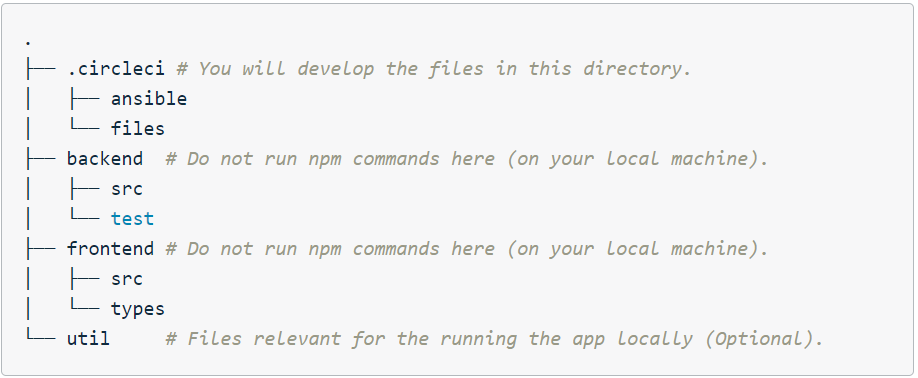

## Give your Application Auto-Deploy Superpowers

A few months ago i learnt some cool CI/CD skills I discovered one way to get better is to try out projects.
This project is the implementation of a CI/CD pipeline for a human resource product(UdaPeople).

## Tools used:

- [Circle CI](www.circleci.com) - Cloud-based CI/CD service
- [Amazon AWS](https://aws.amazon.com/) - Cloud services
- [AWS CLI](https://aws.amazon.com/cli/) - Command-line tool for AWS
- [Terraform](https://www.terraform.io/) - Infrastrcuture as code
- [Ansible](https://www.ansible.com/) - Configuration management tool
- [Prometheus](https://prometheus.io/) - Monitoring tool

### Steps to setup:

1. Fork and then clone the code to your machine so that you can manipulate the files.
2. Here is the directory structure relevant for the project:
   
   #### Contents of the .circleci directory
   - Terraform templates
     You can find those templates in the /.circleci/files/terraform folder. It has these files:
     1. frontend.tf - to create s3 bucket on aws for the frontend
     2. output.tf - holds the output
     3. variables.tf - contains all the variable used
   - CircleCI config.yml
3. Set up CircleCI
   - Set up a CircleCI free account, if you haven't already, that you can use throughout this project.
   - Create a new project in CircleCI using your project (forked) GitHub repo.
4. Make your changes and push to git
